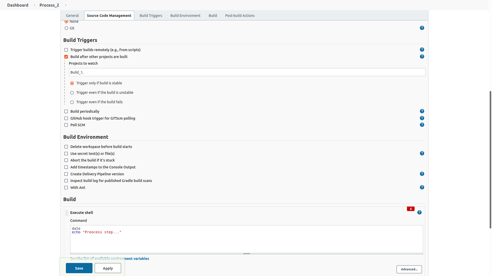
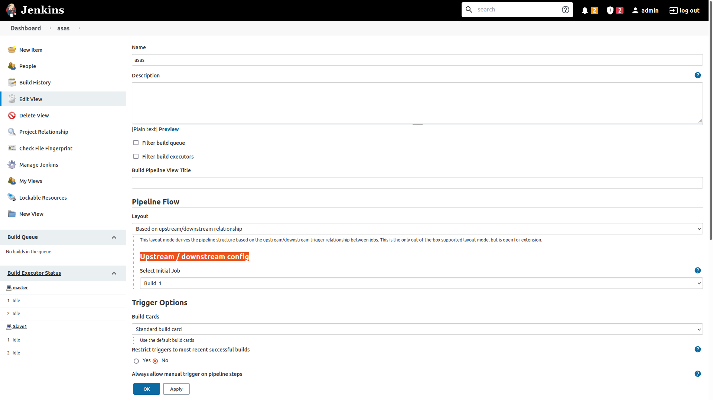
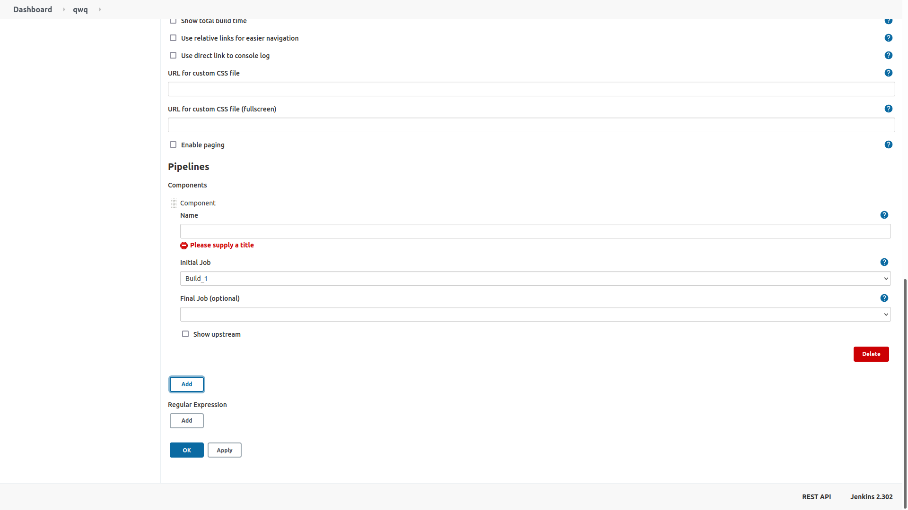
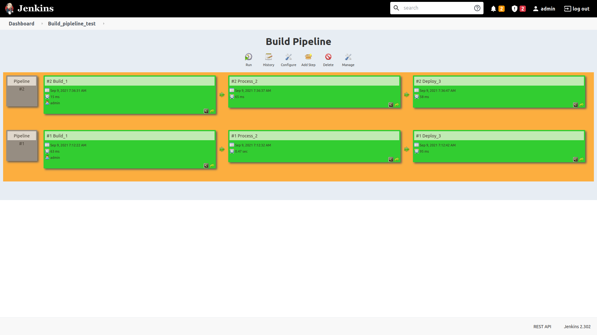
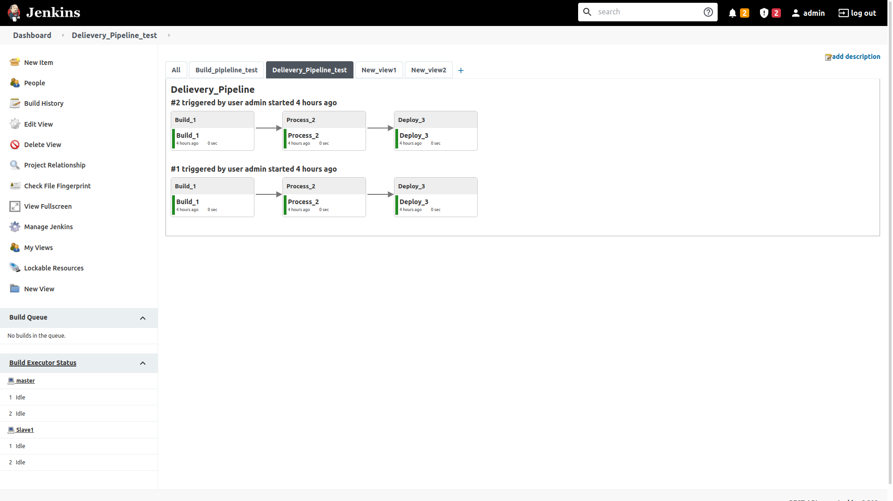

# Create Build pipeline and devlivery pipeline
# Installation
1. Setup jenkins
2. Create jobs e.g `Freestyle project`
    ```
    job1: Build_1
    job2: Process_2
    job3: Deploy_3
    ```
3. In job configuration, add build trigger 'e.g check if build_1 is done then executes process_2'
 </img>
3. Install `Build Pipeline` and `Delivery Pipeline` plugin in jenkins
4. Click on  "+" tab for adding views
5. (For Built pipeline) In `Upstream / downstream config` add first build project
 </img>
6. (For Delivery Pipeline) under `Components` click 'add' to add first build project 
 </img>
4. View built Pipeline or see overview with delivery Pipeline

# Build pipeline
 </img>

# Delivery Pipeline
 </img>