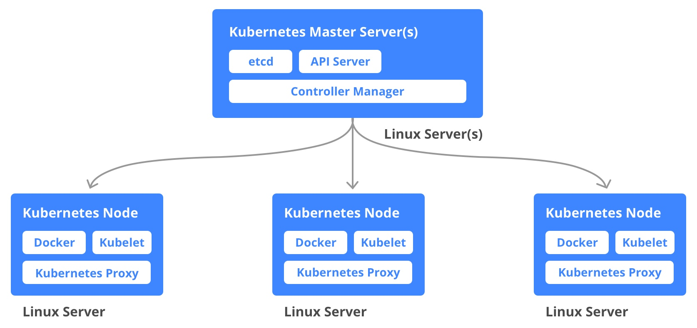

<p align="center">

</p>


 
#  What is Kubernetes?
- Container orchestration tool
- Help manage containers application( be hundered or thosands of containers for instance) in different environment (physical machines, virtual or cloud or hybrid)


#  Advantages of Kubernetes 

- High avaliablity (no downtime)
- Scability or high performance
- Disaster recovery (backup and restore)

#  Components in Kubernetes
<p align="center">

</p>

1. Node (Worker node - simple server/virtual machine)

2. Pod (Running environmnet)
    > * Abstraction layer on top of docker container(only interact with Kubernetes layer)

    > * Usually one application at a time

    > * Get its own IP address (internall IP address not Public)

    > * When container crash, new pods is created with new IP address


3. Service(Permanent/static IP address to each Pod)(Communicate with pods)
    > * Also a load balancer
    > * If pod dies, Service and IP address will stay
    > * Dont have to change the endpoint anymore

4. Ingress(Route traffic to cluster)
    > * Application should be accessible through a browser
    
    > * Need a external service
    ```
    eg. Ingress> Service (http://my-app.com:port)
    ```
5. ConfigMap(for external configuration):
    -Configuration to application (e.g database_url,database_username,database_password)
    - Please use secret to store passwords/cretificates
    ```
    N.B Kubernetes does not manage persistant storage
    ```
    Deployment:
    - Abstraction on top of pods
    - blueprint for my-app
    - specify replicas() for applicaiton
    - Can't replicate db due data store and perventing data insconsistencseis
    - For database use STATEFULSET (take of replicating pods and scaling up, and reads and writes are   syncronised)
    - Usuall host database outside of k8

#  How it works

<p align="center">

</p>

 - Worker Nodes has mutiple pods on it
 - 3 process must be installed on each node (Container runtime,kublet,Kube proxy)
 - Kublet: 
    > * Interact with container + node

    > * Starts pod inside container

    > * Assign resource(CPU,RAM) from node to container
 - Kube Proxy:
    > * Fowards request (e.g make sure my-app fowards request from db service to database pods inside same node)

# References

 Kubernetes Tutorial for Beginners [FULL COURSE in 4 Hours] 
by  TechWorld with Nana
https://www.youtube.com/watch?v=X48VuDVv0do
