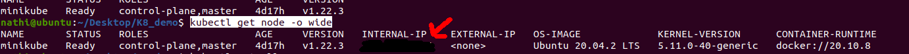

# Create Kubenetes cluster with mongodb and webapp


## Installation
1. Run commands:
```
kubectl apply -f mongo-config.yaml
kubectl apply -f mongo.yaml
kubectl apply -f mongo-secret.yaml 
kubectl apply -f webapp.yaml
```
2. View status
```
kubectl get all
```
# Access exernal IP address of service (with type Nodeport)

```
kubectl get node -o wide
```


- Get IP address of node (e.g worker node)
- Use is internal IP address+port: 
```
http://xxx-xxx-xx-xx:30100
```
# Comands
## Base64 encode password
```
echo -n | base64
```
## Deactivate deployment and services
```
kubectl delete all -l app=mongo
```
or

```
kubectl delete deployments <deployment>
kubectl delete services <services>
kubectl delete pods <pods>
kubectl delete daemonset <daemonset>
kubectl delete secret mongo-secret
```
